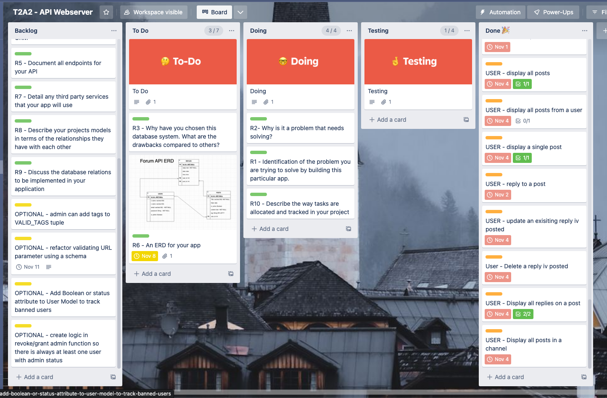

# **Coder Academy - Assignment T2A2 - API Webserver Project. By Mario Lisbona**

# **Table of contents**

- [**Coder Academy - Assignment T2A2 - API Webserver Project. By Mario Lisbona**](#coder-academy---assignment-t2a2---api-webserver-project-by-mario-lisbona)
- [**Table of contents**](#table-of-contents)
  - [**R1 - Identification of the problem you are trying to solve by building this particular app.**](#r1---identification-of-the-problem-you-are-trying-to-solve-by-building-this-particular-app)
  - [**R2 - Why is it a problem that needs solving?**](#r2---why-is-it-a-problem-that-needs-solving)
  - [**R3 - Why have you chosen this database system. What are the drawbacks compared to others?**](#r3---why-have-you-chosen-this-database-system-what-are-the-drawbacks-compared-to-others)
  - [**R4 - Identify and discuss the key functionalities and benefits of an ORM**](#r4---identify-and-discuss-the-key-functionalities-and-benefits-of-an-orm)
  - [**R5 - Document all endpoints for your API**](#r5---document-all-endpoints-for-your-api)
  - [**R6 - An ERD for your app**](#r6---an-erd-for-your-app)
  - [**R7 - Detail any third party services that your app will use**](#r7---detail-any-third-party-services-that-your-app-will-use)
  - [**R8 - Describe your projects models in terms of the relationships they have with each other**](#r8---describe-your-projects-models-in-terms-of-the-relationships-they-have-with-each-other)
  - [**R9 - Discuss the database relations to be implemented in your application**](#r9---discuss-the-database-relations-to-be-implemented-in-your-application)
  - [**R10 - Describe the way tasks are allocated and tracked in your project**](#r10---describe-the-way-tasks-are-allocated-and-tracked-in-your-project)
  - [**References**](#references)

## **R1 - Identification of the problem you are trying to solve by building this particular app.**

I'm building a forum API to create an online community with an environment that encourages open communication between like minded individuals. The forum will help facilitate this by providing a variety of channels where users can make posts that relate to that channel. Users can also post replies to help continue the conversation with meaningful input from the entire forum community.

Administrators will moderate all the interactions that happen on the platform. This will be vital in maintaining the platform's integrity as an environment where open communication can happen.

Administrators will be able to perform important moderation activities including deactivating/archiving posts that are inactive, deleting posts, issuing users warnings and deleting users who are violating the community guidelines.

## **R2 - Why is it a problem that needs solving?**

Open and honest communication is vital in creating a world where people from different backgrounds and ethnicities can appreciate and respect the way their fellow members of society interact and view the world we live in.

If an individual is seen to be communicating in an honest way then the person on the other end of that conversation will feel compelled to reciprocate. This kind of communication leads to a world where differences are celebrated rather than criticised. This fusion of different cultural idea and norms can be the catalyst for creativity and innovation in all societies.

Creating a virtual world where this communication can happen is a step towards it happening more often in the real world. (John E Hind, 2022) [^1] 

## **R3 - Why have you chosen this database system. What are the drawbacks compared to others?**

Before a single line of code has been written, developers will have to tackle the challenge of what technologies to use in their application. One of the major decisions that needs to be made before development starts on any application is what database technology to use. Data is the lifeblood of any application and the way that it will be stored, accessed and used by the application will dictate what technologies will be used.

Databases fall into two broad categories, Relational Databases Management Systems (RDBMS) which store data in a tabular format and NoSQL which stores data in document format. 

Cost was a major factor when choosing a database technology for this forum API. PostgreSQL is an open-source cost effective solution that provides a great alternative compared to similar licenced RDBMS. PostgreSQL was also chosen because of its reliability, robustness and its ability to create and use complex queries.

The data structures and fields used by this forum API will remain unchanged when the API is running. Flexibility with regards to input fields and storing data is one of the biggest advantages of using a NoSQL database. Because this flexibility in data fields was not needed in this project, the decision to use PostgreSQl with its schema approach to storing data made more sense. PostgreSQL also has the added advantage of being able to run NoSQL processes because it can query and store JSON. JSON data will be used in the body of all requests and JSON will be returned to the user in all responses.

No solution is ever the perfect solution, there are always drawbacks that need to be weighed against advantages. Postgres is less efficient than other RDBMS because for every new client connection established a new process which allocates 10mb of memory is created. This is a non-trivial amount of memory and if the Forum API’s user base and activity grows significantly it could become an issue that needs to be addressed. Although PostgreSQL is built with scalability, data integrity and extensibility in mind, these features often come at the expense of speed. For this reason PostgreSQL may not be the ideal solution for simple (no complex queries) workflows that mainly require read operations. PostgreSQL has only a limited number of 3rd party tools. This is because it is the less popular option when it comes to RDBMS solutions. (Amrit Pal Singh, 2021) [^2] (Salman Ravoof, 2022) [^3] (Krasimir Hristozov, 2019) [^4]

## **R4 - Identify and discuss the key functionalities and benefits of an ORM**

## **R5 - Document all endpoints for your API**

View all the endpoint documentation for the Forum API [*here*](./docs/Forum-API-endpoints.md#api-endpoints-documentation-tables-of-contents)

## **R6 - An ERD for your app**

## **R7 - Detail any third party services that your app will use**

## **R8 - Describe your projects models in terms of the relationships they have with each other**

## **R9 - Discuss the database relations to be implemented in your application**

## **R10 - Describe the way tasks are allocated and tracked in your project**

To manage all the tasks for this project is used a kanban board on Trello. I first created the users stories below that apply to the forum API. All the tasks that need to be completed in the project, including all the documentation, answers to assignment questions and the actual coding of different routes for the API are assigned to tickets and placed in the backlog column. I then assigned different coloured labels for different groups of tasks, green for R1, R2, R3  assignment rubrics, purple for assignment requirements to check, yellow for optional features after the minimum viable product was complete and orange for coding tasks. This allowed me to get a get a quick overview of of the project by showing where different tasks and groups of tasks where located in the cycle of the kanban board.

I then wrote all the user stories for the API. The user stories below are broken down into two classes of users that will be accessing the forum API, Administrator and user, and represent all the different routes to resources that the API will facilitate.

| User          	| Action                                                                                                 	|
|---------------	|--------------------------------------------------------------------------------------------------------	|
| Administrator 	| I want to view all user profiles                                                                       	|
| Administrator 	| I want to view a single user profile                                                                   	|
| Administrator 	| I want to delete any posts that violate community guidelines                                           	|
| Administrator 	| I want to delete any replies that violate community guidelines                                         	|
| Administrator 	| I want to deactivate a post that has had no activity for 3 months or has violated community guidelines 	|
| Administrator 	| I want to activate a post if the owner requests it                                                     	|
| Administrator 	| I want to view all archived/deactivated posts                                                          	|
| Administrator 	| I want to view all replies on the forum                                                                	|
| Administrator 	| I want to view all replies posted by a user                                                            	|
| Administrator 	| I want to issue a warning to a user                                                                    	|
| Administrator 	| I i want to a user to be automatically deleted on the next offence post third warning                     |
| Administrator 	| I want to grant admin rights to another user                                                           	|
| Administrator 	| I want to revoke admin rights from another user                                                        	|
| Administrator 	| I want to be able to view the forum statistics                                                         	|
| User          	| I want to register to use the forum                                                                    	|
| User          	| I want to login to participate in the forum                                                            	|
| User          	| I want to view my profile details                                                                      	|
| User          	| I want to update my profile details                                                                    	|
| User          	| I want to create a post in the forum                                                                   	|
| User          	| I want to edit a post i've posted to the forum                                                         	|
| User          	| I want to delete a post i posted to the forum                                                          	|
| User          	| I want to read all posts in the forum                                                                  	|
| User          	| I want to read a specific post in the forum                                                            	|
| User          	| I want to reply to a post in the forum                                                                 	|
| User          	| I want to update a reply iv already posted                                                             	|
| User          	| I want to delete a reply iv already posted                                                             	|
| User          	| I want to view all the replies to a specific post in the forum                                         	|
| User          	| I want to display all the posts in a forum channel                                                     	|
| User          	| I want to display all the posts from a particular user                                                 	|

I then created a kanban board with Trello to allocate and track tasks for the duration of the project. The kanban board is comprised of 5 columns, from left to right they are:
- Backlog
- To Do
- Doing
- Testing
- Done

 

I set Work In Progress limits (WIP's) on the columns to track how many tasks where in each stage of the project. Once the kanban board was setup i would move tasks or tickets from the backlog column into the todo until that was full. At this stage i would give each ticket a date for the work to be completed by. Then i would take a task/tasks fro To Do and place it in the Doing column and then begin on the task. I added checklists for the more complicated tasks to keep track of each sub-task that would need to be completed before that ticket could be moved to the testing and Done columns.

If any completed features needed refactoring or their scope changed, then i would move the ticket back to the To Do column, adjust the checklists, date and the process would start again for that task.

You can become a member of my T2A2 Web API trello board [*here*](https://trello.com/invite/b/tgZAzcbl/ATTI8dca09e313c793fbac3a556003958f8aC962B77D/t2a2-api-webserver) to view all the tickets that were created.

## **References**

- [^1 - R2](#r2---why-is-it-a-problem-that-needs-solving) - John E Hind (2022) [*Why Is Being Open And Honest So Important?*](https://www.compass-resolution.com/2017/02/27/why-is-being-clear-open-and-honest-in-your-communications-so-important/), Compass Resolution website, accessed 07 November 2022.
- [^2 - R3](#r3---why-have-you-chosen-this-database-system-what-are-the-drawbacks-compared-to-others) - Amrit Pal Singh (2021) [*Should I Use MongoDB or PostgreSQL?*](https://medium.com/geekculture/should-i-use-mongodb-or-postgresql-ba2c1bb8b768), Medium website, accessed 08 November 2022.
- [^3 - R3](#r3---why-have-you-chosen-this-database-system-what-are-the-drawbacks-compared-to-others) - Salman Ravoof (2022) [*MongoDB vs PostgreSQL: 15 Critical Differences*](https://kinsta.com/blog/mongodb-vs-postgresql/#what-is-postgresql), Kinsta website, accessed 08 November 2022.
- [^4 - R3](#r3---why-have-you-chosen-this-database-system-what-are-the-drawbacks-compared-to-others) - Krasimir Hristozov (2019) [*MySQL vs PostgreSQL -- Choose the Right Database for Your Project*](https://developer.okta.com/blog/2019/07/19/mysql-vs-postgres), Okta Developer website, accessed 08 November 2022.

** https://developer.mozilla.org/en-US/docs/Web/HTTP/Status**
https://regexr.com/38tvj
https://c4model.com/

https://vertabelo.com/blog/crow-s-foot-notation/
